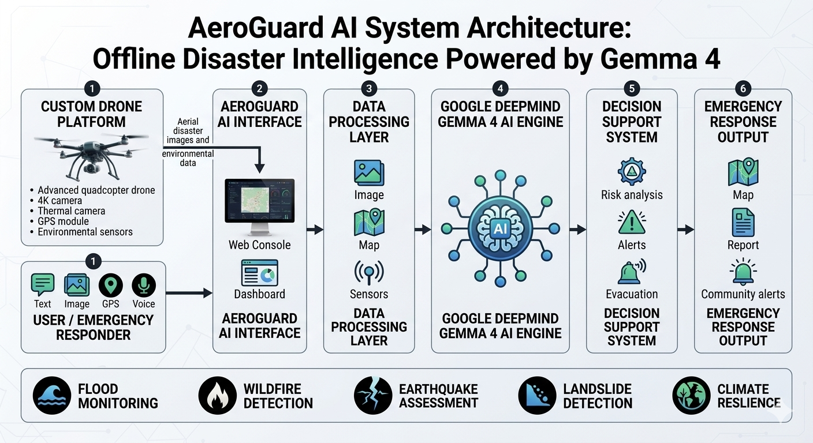

# AeroGuard AI
## Offline Disaster Intelligence Powered by Google DeepMind's Gemma 4

AeroGuard AI is an AI-powered disaster response assistant designed to help communities and emergency responders make faster decisions during floods and climate-related emergencies.

## Problem

Many communities experience delayed emergency response because of limited access to real-time information, poor connectivity, and a lack of intelligent decision-support systems.

During disasters, responders need quick answers:

- Where is the affected area?
- How severe is the damage?
- What actions should be prioritized?

## Solution

AeroGuard AI uses Google DeepMind's Gemma 4 model as the core intelligence engine to analyze disaster information and generate actionable recommendations.

The system combines artificial intelligence, computer vision, and disaster management workflows to support faster emergency decisions.

The system helps users:

- Analyze drone and disaster images
- Understand emergency situations
- Generate response reports
- Receive AI-powered recommendations

## How Gemma 4 is Used

Gemma 4 provides the reasoning capability behind AeroGuard AI.

User inputs:

- Drone images
- Emergency descriptions
- Situation information

Gemma 4 processes this information and generates:

- Risk assessments
- Emergency recommendations
- Situation reports
- Decision-support insights

## System Architecture

AeroGuard AI combines disaster data collection, AI reasoning, and emergency response workflows.

## Drone Integration

AeroGuard AI is designed to integrate with custom-built drone platforms.

The drone collects aerial images, GPS information, and sensor data. Gemma 4 analyzes this information to generate disaster intelligence and emergency recommendations.

Read more:
[Drone Integration](docs/drone-integration.md)

## Technology Stack

- Google DeepMind Gemma 4
- Python
- Streamlit
- Computer Vision
- AI-powered disaster analysis
- Drone data integration

## Sustainable Development Goals

AeroGuard AI supports:

### SDG 11: Sustainable Cities and Communities

Improves disaster preparedness and helps communities make faster emergency decisions.

### SDG 13: Climate Action

Supports climate resilience by providing AI-assisted analysis for floods, fires, storms, and other climate-related disasters.

## Future Development

Future improvements include:

- Real-time drone video analysis
- Offline edge deployment
- Weather and flood data integration
- Emergency service coordination
- Advanced multimodal Gemma 4 capabilities
