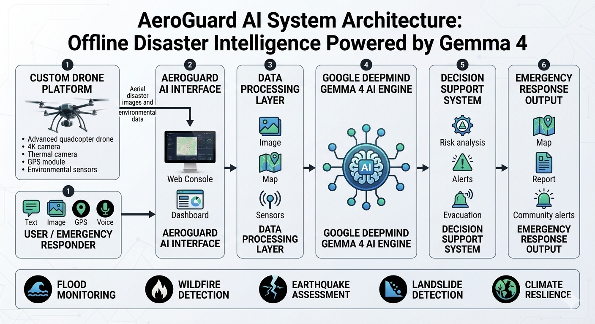

# AeroGuard AI

## Offline Disaster Intelligence Powered by Google DeepMind's Gemma 4

AeroGuard AI is an AI-powered disaster response assistant designed to help communities, emergency responders, and disaster management teams make faster decisions during floods and climate-related emergencies.

The system combines **Google DeepMind's Gemma 4 multimodal AI**, computer vision, and drone intelligence workflows to analyze disaster situations and generate actionable emergency recommendations.

---

# Problem

Many communities experience delayed emergency response because of:

- Limited access to real-time information
- Poor connectivity during disasters
- Lack of intelligent decision-support systems
- Difficulty assessing affected areas quickly

During emergencies, responders need fast answers:

- Where is the affected area?
- How severe is the situation?
- Who is at risk?
- What resources are required?
- What actions should be prioritized?

---

# Solution

AeroGuard AI provides an intelligent disaster analysis system powered by Gemma 4.

The system analyzes emergency information and generates structured response reports to support faster decision-making.

AeroGuard AI helps users:

- Analyze disaster descriptions
- Analyze drone and disaster images
- Identify potential hazards
- Estimate affected areas
- Generate emergency response recommendations
- Support disaster management decisions

---

# How Gemma 4 Powers AeroGuard AI

Google DeepMind's Gemma 4 serves as the core reasoning engine behind AeroGuard AI.

Gemma 4 provides multimodal intelligence, allowing the system to understand both text and images.

## User Inputs

- Emergency reports
- Drone imagery
- Disaster scene images
- Situation information

## Gemma 4 Processing

Gemma 4 analyzes the information and generates:

- Risk assessments
- Disaster classification
- Hazard identification
- Emergency recommendations
- Situation reports
- Decision-support insights

---

# System Architecture

AeroGuard AI combines disaster data collection, artificial intelligence, and emergency response workflows.

The system architecture includes:

1. Data Collection Layer
   - Drone images
   - Disaster reports
   - Sensor information

2. AI Intelligence Layer
   - Gemma 4 multimodal analysis
   - Computer vision processing
   - Risk assessment generation

3. Response Layer
   - Emergency recommendations
   - Situation reports
   - Decision support

---

# Drone Integration

AeroGuard AI is designed to integrate with custom-built drone platforms.

Drones collect:

- Aerial images
- GPS coordinates
- Environmental information
- Disaster scene data

Gemma 4 analyzes this information to generate disaster intelligence and emergency recommendations.

More information:

[Drone Integration Documentation](docs/drone-integration.md)

---

# Gemma 4 Integration

AeroGuard AI uses Google's Gemma 4 E2B multimodal model as its AI reasoning engine.

Gemma 4 enables:

- Disaster report analysis
- Image-based flood and damage assessment
- Risk classification
- Emergency response planning
- Automated situation reporting

## Example Output

The system generates:

- Risk level
- Affected area estimation
- Visible hazards
- People at risk
- Required resources
- Immediate emergency actions
- Drone observations

---

# Technology Stack

- Google DeepMind Gemma 4
- Python
- Streamlit
- Computer Vision
- Artificial Intelligence
- Drone Data Integration
- Offline AI Deployment

---

# Sustainable Development Goals

AeroGuard AI supports the United Nations Sustainable Development Goals.

## SDG 11: Sustainable Cities and Communities

Improves disaster preparedness by helping communities and responders make faster emergency decisions.

## SDG 13: Climate Action

Supports climate resilience through AI-assisted analysis of floods, storms, fires, and other climate-related disasters.

---

# Current Capabilities

✅ Disaster report analysis  
✅ Flood risk assessment  
✅ Emergency response recommendations  
✅ Disaster image understanding  
✅ AI-generated situation reports  
✅ Gemma 4 multimodal reasoning  

---

# Future Development

Future improvements include:

- Real-time drone video analysis
- Offline edge deployment on emergency devices
- Weather and flood data integration
- Emergency service coordination
- Advanced multimodal Gemma capabilities
- Automated disaster mapping

---

# Project License

This project is licensed under the Apache License 2.0.

---

# About

AeroGuard AI is an offline disaster intelligence assistant powered by Google DeepMind's Gemma 4, designed to improve emergency response and climate resilience.
